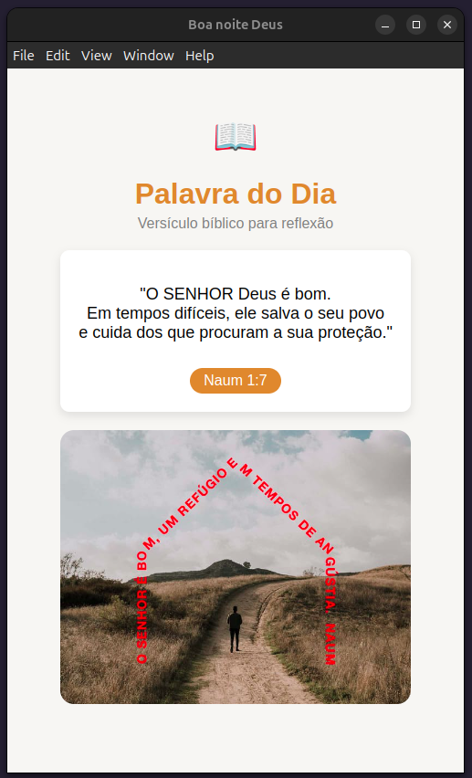

# 📖 Palavra do Dia

> **Um aplicativo simples em ElectronJS** para exibir versículos bíblicos acompanhados de belas imagens.

<p align="center">
  
</p>

## ✨ Funcionalidades

- 📜 **Versículo do dia** com referência bíblica.
- 🖼️ **Imagem temática** vinda de API externa.
- 🎨 **Layout clean e minimalista**, inspirado em cartões de reflexão.

---

## 🛠️ Tecnologias Utilizadas

- [ElectronJS](https://www.electronjs.org/) — para criar o aplicativo desktop.
- HTML5, CSS3 e JavaScript.
- API de versículos bíblicos.
- API de imagens para ilustração.

---

## 🚀 Como Executar

1. **Instalar dependências**
   ```bash
   npm install
   ```
2. **Executar**
   ```bash
   npm run start
   ```
